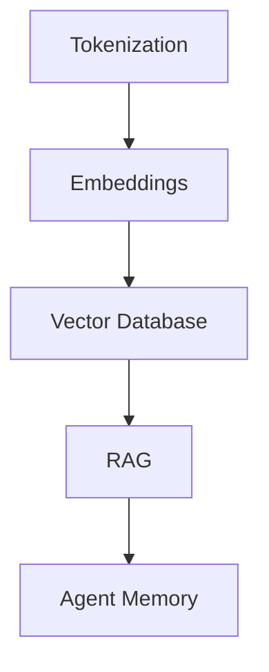

# Article Analysis (Stages 1–2)

## Stage 1 — Analyze the Article

Read the article fully before producing any output. The first job is to understand structure, not explain content.

### Step 1: Article Overview

Present this metadata:

```
## Article Overview

- **Title**: ...
- **Author**: ...
- **Source**: ...
- **Publication Date**: ...
- **Estimated Reading Time**: ...
- **Difficulty**: Beginner / Intermediate / Advanced
- **Target Audience**: ...
- **Primary Domain**: ...
- **Secondary Domains**: ...
```

### Step 2: Structure Analysis

Identify:
- Main sections and their topics
- Algorithms or techniques discussed
- Frameworks and technologies mentioned
- Research papers or external references cited
- Code snippets and examples present
- Key arguments or claims made

### Step 3: Learning Objectives

State clearly what the reader should understand after fully processing this article. Write 3–7 specific learning objectives.

### Step 4: Key Takeaways

Extract the 5–10 core ideas the article communicates. These are the fundamental messages — not details, but the big-picture points.

### Step 5: Article Quality Assessment

Before the user invests time, evaluate the article honestly:

| Dimension | Score (1-5) | Notes |
|-----------|-------------|-------|
| Technical Accuracy | | Are claims correct and well-supported? |
| Depth | | Does it explain WHY, or only WHAT/HOW? |
| Completeness | | Are important related concepts omitted? |
| Bias | | Educational vs opinionated vs promotional? |
| Practical Value | | Can ideas be applied in real systems? |
| Readability | | Clear structure, progressive complexity? |

**Recommendation**: Worth deep study / Worth a careful read / Skim for key ideas / Skip and find a better source

If the article has significant issues, explain them and suggest whether to proceed or find alternatives.

---

## Stage 2 — Learning Preparation

### Step 1: Generate Concept Tags

Extract every concept the article assumes the reader knows or introduces. Organize into three tiers:

```
## Required Concepts

### Core Concepts (must understand to follow the article)
- Concept A
- Concept B
- Concept C

### Supporting Concepts (helps deepen understanding)
- Concept D
- Concept E

### Advanced Concepts (mentioned but not central)
- Concept F
- Concept G
```

Present these as a tagged list. Include brief one-line descriptions for each concept to help the user assess their own familiarity.

### Step 2: Ask the User

Present options:

```
How would you like to proceed?

1. **I know all concepts** — skip to guided reading
2. **Teach me selected concepts** — tell me which ones you're unfamiliar with
3. **Teach everything inline** — explain concepts as they appear during reading
4. **Teach all prerequisites first** — cover every concept before reading
```

Wait for the user's response. Do not proceed until they answer.

### Step 3: Prerequisite Lessons

For each concept the user wants taught, produce a compact lesson:

```
## [Concept Name]

**What it is**: One-sentence definition.

**Problem it solves**: What was difficult or impossible before this existed?

**Why it exists**: The motivation — what drove its creation.

**Simple example**: A concrete, minimal example showing the concept in action.

**Real-world analogy**: Connect to something from everyday life or familiar engineering.

**Common misconceptions**: What beginners typically get wrong about this.

**Where it appears in this article**: Specific sections where this concept is used, so the user knows why they're learning it now.
```

Keep each lesson focused — aim for 150-250 words per concept. The goal is enough understanding to follow the article, not a complete tutorial.

### Concept Dependency

If concepts depend on each other, teach them in dependency order. Example:



Teach A before B, B before C, etc. State the dependency chain to the user so they understand the learning order.
