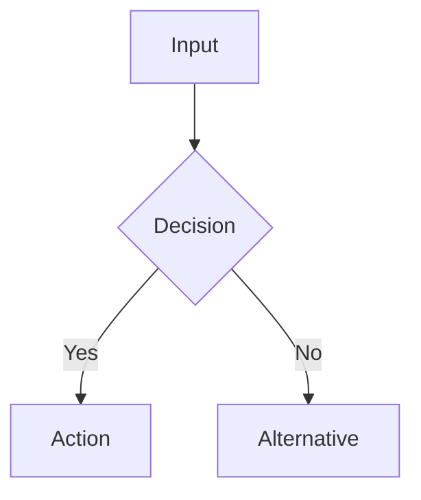
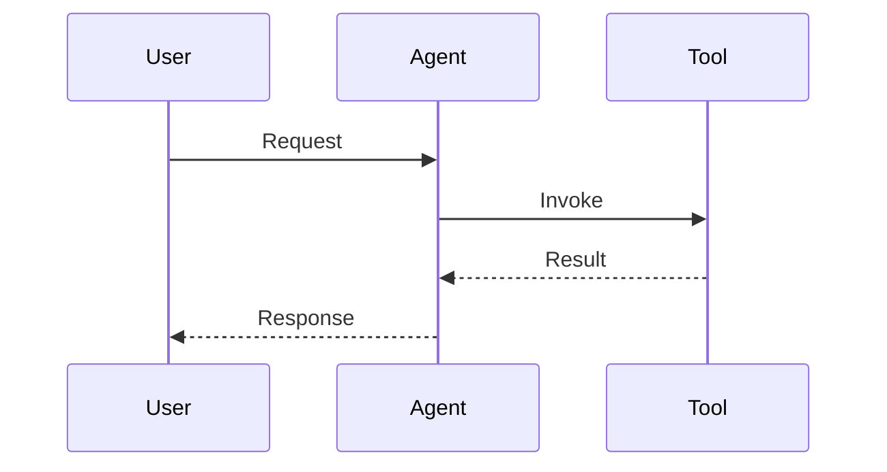
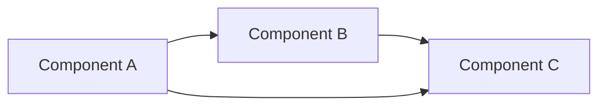
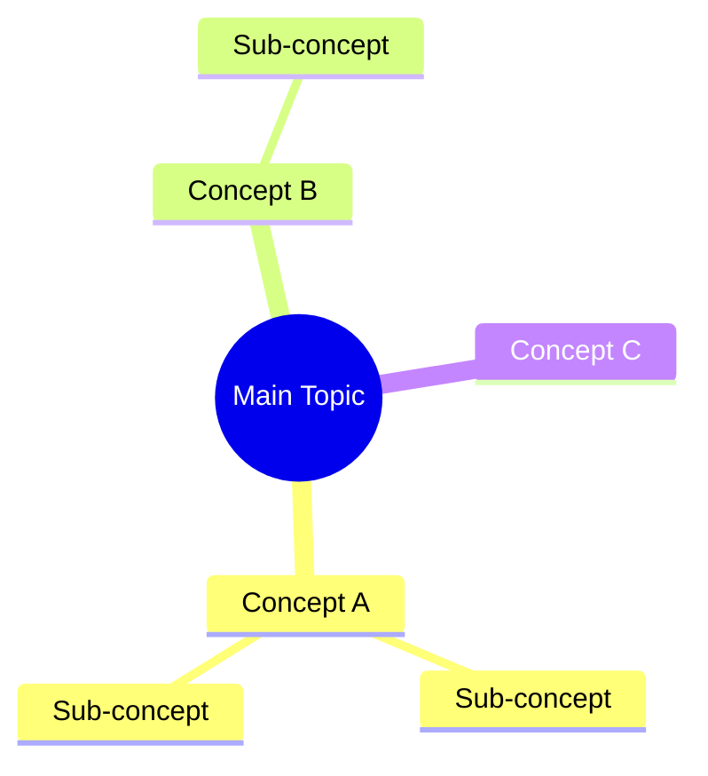
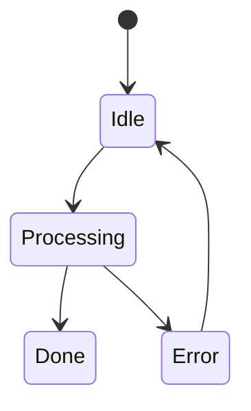

# Guided Reading (Stages 3–4)

## Stage 3 — Section-by-Section Guided Reading

Break the article into logical sections. For each section, produce the following structure. This is the heart of the skill — take time here.

### Per-Section Template

```
## Section: [Section Title or Topic]

### What this section teaches
One sentence describing the section's goal.

### Plain English
Rewrite the core ideas in clear, engaging language. Remove jargon where possible. If the original writing is dry, inject energy — explain the motivation, the stakes, the "so what."

### Key Concepts
- **Term 1**: Brief explanation
- **Term 2**: Brief explanation

### Why this matters
What problem does this solve? Why should an engineer care? What would go wrong without this?

### Engineering Intuition
- **Why was this invented?** What pain point existed before?
- **What existed before?** Previous solutions or approaches.
- **Why wasn't the old way enough?** Limitations that drove change.
- **Trade-offs**: What do you gain and lose with this approach?
- **When NOT to use this**: Conditions where this is the wrong choice.
- **Alternatives**: Other approaches that solve the same problem differently.

### Real-World Examples
- **Industry example**: How a company or project uses this
- **Engineering scenario**: How this applies in day-to-day software work
- **Analogy**: A non-technical parallel that makes the concept stick

### Reflection Questions
- [Question that tests comprehension]
- [Question that requires applying the concept]
- [Question that challenges assumptions]
```

### Pacing

- Process 1-3 sections at a time depending on density
- After each batch, ask if the user wants to continue, revisit, or ask questions
- If the user asks a question mid-reading, answer it fully before continuing
- Adjust depth based on user engagement — if they seem comfortable, move faster; if they ask many questions, slow down

### Handling Code Snippets

When the article contains code:
1. Explain what the code does in plain English first
2. Walk through the logic step by step
3. Highlight non-obvious parts
4. If the code has issues or could be improved, mention it
5. Provide a mermaid diagram of the code flow if the logic is complex

---

## Stage 4 — Deep Understanding

After completing the guided reading, build durable mental models.

### Comparisons

Identify concepts in the article that have natural comparisons. Present them as structured tables:

```
| Aspect | Approach A | Approach B |
|--------|-----------|-----------|
| Speed | ... | ... |
| Complexity | ... | ... |
| When to use | ... | ... |
| Trade-off | ... | ... |
```

Only compare things that genuinely illuminate understanding. Don't force comparisons.

### Common Mistakes

List misconceptions that beginners typically have about this topic:

```
## Common Mistakes

1. **Mistake**: [What people get wrong]
   **Reality**: [What's actually true]
   **Why it matters**: [Consequences of the misunderstanding]

2. ...
```

### Visual Learning — Mermaid Diagrams

Generate mermaid diagrams that capture the article's core ideas. Choose diagram types based on content:

**Flowchart** — for processes, algorithms, decision logic:


**Sequence diagram** — for interactions between components:


**Architecture diagram** — for system components and relationships:


**Mind map** — for concept relationships:


**State diagram** — for state machines or lifecycle:


Generate 2-4 diagrams per article. Choose the types that best represent the content. Every diagram should have a brief explanation of what it shows and why it matters.

### Mental Model

Distill the entire article into one concise conceptual model — a single diagram or short paragraph that captures the essence. This is what the user should be able to recall a month later.

```
## Mental Model

[One mermaid diagram or 3-5 sentence conceptual summary that captures
the article's core contribution in a way that's easy to remember]
```
